# 《现代操作系统》学习守则

> 阅读章节导读，尝试带着问题去学习
>
> 做lab

# 第1章 操作系统概述

## 操作系统的职责

1. 操作系统需要对硬件进行抽象和管理

Q: 如果一个机器只有一个应用程序，并且开启后自动运行不会退出，是否还需要操作系统？

> A：
>
> 1. 有些对性能和时延要求极高的场景，就是这样实现的。参考“基于外核架构的库操作系统“与”虚拟化容器”方法。
> 2. 需要应用与硬件打交道，直接实现“对硬件资源的管理和抽象”的功能。
>    1. 如果崩溃，缺乏诊断和调试的机会。

2. 操作系统需要为应用提供服务，并进行管理

```cpp
#include<stdio.h>
int main() {
	while(1) {
    	printf("hello\n");
  	}
  	return 0;
}
//Q: 这个程序会耗尽物力资源，让计算机崩溃吗？
//A: 不会，因为操作系统会对硬件资源按照一定的优先级在不同应用之间进行调度。(?)
```

如果想要把计算机卡死，应该怎么做？

```cpp
#include<stdio.h>
int main() {
	while(1) {
        fork(); // 以指数级的速度，创建大量的进程，每个进程创建时，都要消耗一定的资源
    	printf("hello\n");
  	}
  	return 0;
}
//Q: 这个程序会耗尽物力资源，让计算机崩溃吗？
//A: 不会，因为操作系统具有“为每个应用的资源设置配额“的机制。
```


## 阿姆达尔定律

阿姆达尔定律(Amdahl's Law)：刻画了并行计算中加速比与并行计算的并行程序占比$(p)$的关系。

即一个并行程序最大的加速比是$1/((1-p) + p/s)$，其中$s$是并行部分的加速比。

## 系统调用

example：

printf 调用标准库 libc 中的 write 函数。

libc在准备好相关参数后，执行 svc 指令（ARM指令，表示特权调用supervisor call），使得控制流从用户空间"下陷"到内核地址空间。

操作系统的内核的下陷处理函数，根据系统调用传入的第一个参数，识别出该调用需要执行操作系统内核提供的 sys_write 函数，从而通过系统调用表，调用对应函数。


## POSIX标准

Portable Operating System Interface for uniX.

通常由C Library(libc)来实现。它是一套标准的操作系统api。

> 常见的libc包括：
>
> - glibc
> - musl
> - eglibc
> - Android也实现了一个名为bionic

1. 应用程序只需要调用 libc 提供的接口，就可以实现对操作系统功能的调用。
2. 不同的操作系统可以通过对 libc 的移植来支持现有的应用生态。


### POSIX API和Linux ABI

API(Application Programming Interface)应用编程接口

ABI(Application Binary Interface)应用二进制接口：某个特定体系结构下两层软件之间的二进制层面的交互接口。

- ELF(Executable and Linkable Format)
- EXE in windows
- 应用之间的调用约定（包括参数传递和返回值处理）
- 数据模式（大端模式、小端模式）

>是否可以通过ABI的同步，实现异构设备的任务分配？

## ChCore

ChCore 采用微内核架构（微内核是一种设计原则）。

大部分操作系统功能以系统服务的形式运行在用户态。

文件系统不再属于内核的一部分，而是作为一个系统服务运行在用户态，实际上是一个独立的用户态进程。

> 优势：文件系统的崩溃或安全漏洞很难影响到操作系统的其他功能。如内存管理，设备驱动。其他组件的问题也很难影响到文件系统。

在内核态，ChCore只包括最基础的职责与功能，主要是：内存管理、调度器、进程间通信、权限管理。

## 冯诺依曼结构

- 中央处理单元(Central Processing Unit, CPU)
- 存储器(Memory Unit)
- 输入输出(Input and Output, I/O)

# 第2章 硬件结构

## 指令集——AArch64

AArch64 属于 RISC

AArch64 每条指令的长度固定为 4 字节，指令类型包括：

- 数据搬移指令：如 mov
- 寄存器计算指令：如 add, sub
- 内存读写指令：如内存加载 ldr, 内存写入 str
- 跳转指令：如无条件跳转 b
- 过程调用指令：调用指令 bl, 返回指令 ret
- 特权指令：读取系统寄存器指令 msr, 写入系统寄存器指令 mrs

## 特权级

AArch64的特权级被称为异常级别(Exception Level, EL)

- EL0: 用户态，最低的特权级，应用程序运行在该特权级
- EL1: 内核态，操作系统运行在该特权级
- EL2: 在虚拟化场景下需要，虚拟机监控器 (Virtual Machine Monitor, VMM, 也称为Hypervisor) 通常运行在该特权级。
- EL3: 和安全特性 Trustzone 相关，负责普通世界 (normal world) 和安全世界(secure world)之间的切换。
  - Trustzone 是从 ARMv6 体系结构开始引入的安全特性，如今已被广泛使用。该特性从逻辑上将整个系统分为安全世界和普通世界，计算资源可以被划分到这两个世界中。安全世界可以不受限制地访问所有的计算资源，而普通世界不能访问被划分到安全世界的计算资源。比如说，普通世界不能访问属于安全世界的物理内存和设备。


### EL0切换到EL1的场景

同步的 CPU 特权级切换，由 CPU 中执行的指令所导致的：

1. 应用程序需要调用操作系统提供的系统调用。svc (特权调用, supervisor call)
2. 应用程序执行的指令触发了异常 (exception)
   1. 如访存指令会出发缺页异常 (page fault)

异步的CPU特权级切换，不是由CPU执行的指令所导致的：

3. 应用程序执行的过程中，CPU收到一个来自外设的中断 (interrupt)


发生特权级切换的时刻，CPU保存当前执行状态，主要包括：

| 保存的状态                                           | 保存的位置                                                   |
| ---------------------------------------------------- | ------------------------------------------------------------ |
| 触发异常的指令地址(PC, Program Counter)              | ELR_EL1(异常链接寄存器, Exception Link Register)             |
| 异常原因（即异常是由于svc指令还是由于访存缺页导致的) | ESR_EL1(异常症状寄存器, Exception Syndrome Register)         |
| 栈指针(SP, Stack Pointer)                            | 从SP_EL0(应用程序使用的栈)切换到SP_EL1(操作系统通过这个寄存器配置异常处理过程中使用的栈) |
| CPU的相关状态                                        | SPSR_EL1(已保存的程序状态寄存器, Saved Program Status Register)<br />引发缺页异常的地址保存在FAR_EL1(错误地址寄存器, Fault Address Register) |


操作系统可以在异常向量表中为不同的异常类型配置相应的异常处理函数。因此，当发生特权级切换时，CPU 会读取 VBAR_EL1 (向量基地址寄存器，Vector Base Address Register) 来获得异常向量表 (exception vector table）的基地址，然后根据异常原因(ESR_EL1中保存的内容)调用操作系统设置的相应异常处理函数。


异常处理完成后，执行eret(异常返回，Exception Return)指令，恢复CPU自动保存的EL0状态，并切回到EL0。

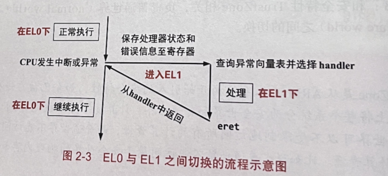


## 寄存器

AArch64中，有31个64位的通用寄存器，X0～X30。

| 寄存器    |                                                         |                                                        |
| --------- | ------------------------------------------------------- | ------------------------------------------------------ |
| X29       | 帧指针(Frame Pointer, FP)寄存器                         | 保存函数调用过程中栈顶的地址                           |
| X30       | 链接指针(Link Pointer, LP)寄存器                        | CPU 在执行函数调用指令 bl 时会自动把返回地址保存在其中 |
| TTBR0_EL1 | 页表基地址寄存器(Translation Table Base Register, TTBR) | 负责翻译虚拟地址空间中不同的地址段, 通常[0, 2^48)      |
| TTBR1_EL1 | 页表基地址寄存器(Translation Table Base Register, TTBR) | 负责翻译虚拟地址空间中不同的地址段, 通常[2^48, 2^64)   |
| TCR_EL1   | 翻译控制寄存器(Translation Control Register)            | 决定页表基地址负责的地址范围                           |


Q: 一个64位的寄存器是怎么负责翻译的？

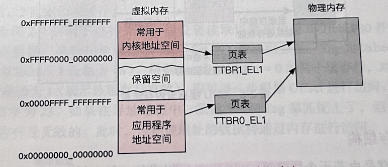


## 物理内存与CPU缓存

CPU使用物理内存的过程：

通过总线向物理内存发送一个读写请求，包括目标地址，(如果是写请求，则还包括写入值)。

物理内存收到请求后，进行读写，(如果是读请求，则返回读取值到CPU)。


**内存访问速度很慢：一次内存访问可能花费上百个时钟周期。**

**所以引入了缓存。一般最快只需要几个时钟周期**。

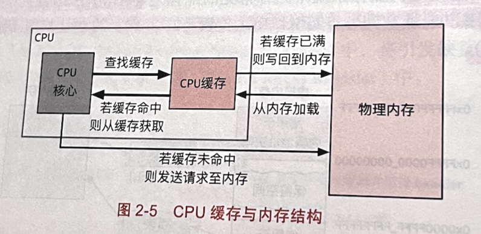


### 缓存结构

CPU缓存是由若干个缓存行（cache line）组成的。

缓存行常见的是 64 字节。

每个缓存行包括：

- 一个有效位(valid bit)，用于表示其是否有效；
- 一个标记地址(tag address)，用于标识其对应的物理地址；
- 一些其他的状态信息。


CPU把物理内存中的数据读到CPU缓存，以及把数据写会到物理内存，都是以缓存行(cache line, 64 bytes)为单位的。

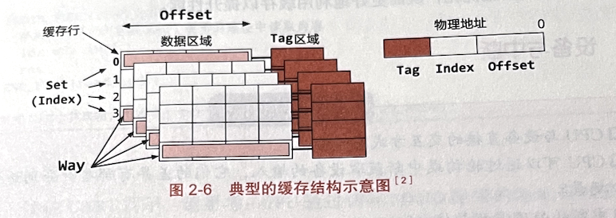

物理地址在逻辑上分为:Tag, Set(组，也称为Index)和Offset三段。

组(Set)和路(Way)


物理地址中的Set段能表示最大数目为组。

例如，如果set段的位数是8，那么对应的 CPU 缓存的组数就是 256 （2^8=256）。


同一组（即 set 段相等）下，支持的最大Tag数则称为路，即同一组下的缓存行数目。

图2-6表示的是4路组相联(4-Way Set Associative)。


### 缓存寻址

先匹配set，再匹配tag，再看有效位

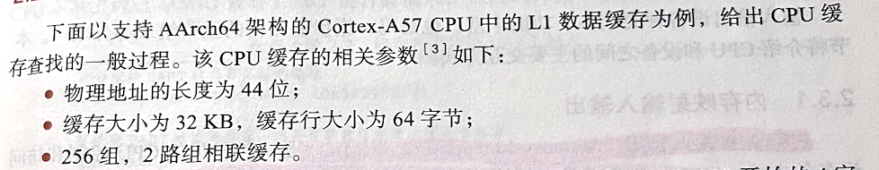

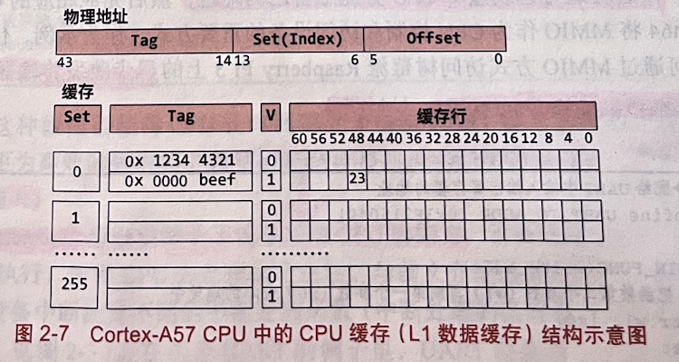


## 设备与中断

### 内存映射输入输出

内存映射输入输出 (Memory-Mapped I/O, MMIO) 是一种常见的 CPU 控制和访问设备的方式。

**MMIO**的原理是：

​	把输人输出设备和物理内存放到同一个地址空间，为设备内部的内存和奇存器也分配相应的地址。

​	当CPU 通过MMIO 的方式为一个设备分配了地址之后，CPU 可以使用和访问物理内存一样的指令（ldr 和str） 去读写这些属于设备的地址；设备会通过总线监听 CPU 分配给自己的地址，然后完成相应的 CPU 访问请求。

​	AArch64將 MMIO 作为 CPU 控制和访问设备的重要方式。


通过 MMIO 方式访问树莓派 Raspberry Pi 3 上的异步收发传输器(Universal Asynchronous Receiver/Transmitter, UART)。

```assembly
// 分配给UART中输入输出寄存器的地址
#define UART_IO_ADDR (0x3F215040)

BEGIN_FUNC(write_addr)
	// 把函数第二个参数(w1)写到第一个参数(x0)表示的地址中
	str w1, [x0]
	ret
END_FUNC(write_addr)

// 从UART输出的样例: write_addr(UART_TO_ADDR, 'a');

BEGIN_FUNC(read_addr)
	ldr w0, [x0]
	ret
END_FUNC(read_addr)

// 从UART获取输入的样例: int a = read_addr(UART_TO_ADDR)
```


### 轮询与中断

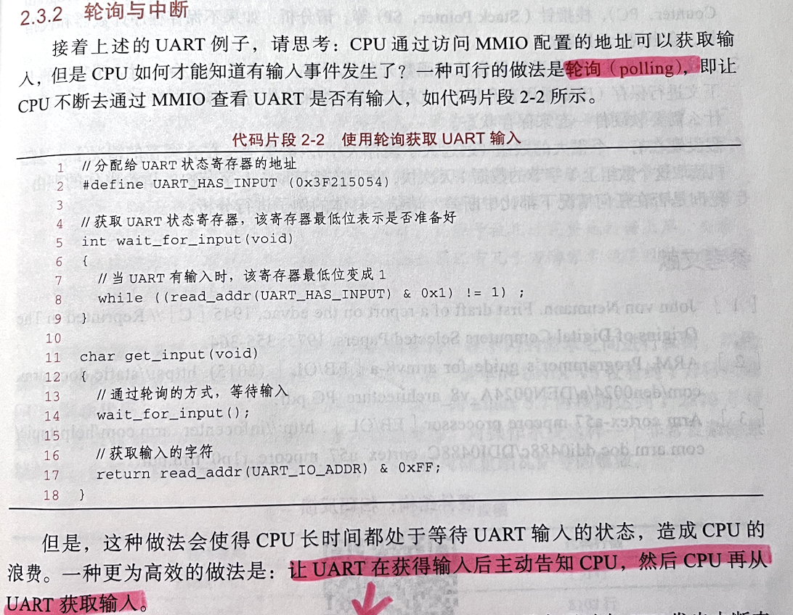


中断机制，赋予了设备通知CPU的能力。

操作系统为不同的设备中断配置不同的中断处理函数。

与异常的处理过程类似。


中断设备的功能：

- **让设备主动通知CPU**
- **让一个CPU核心通知另一个CPU核心**


## 思考题

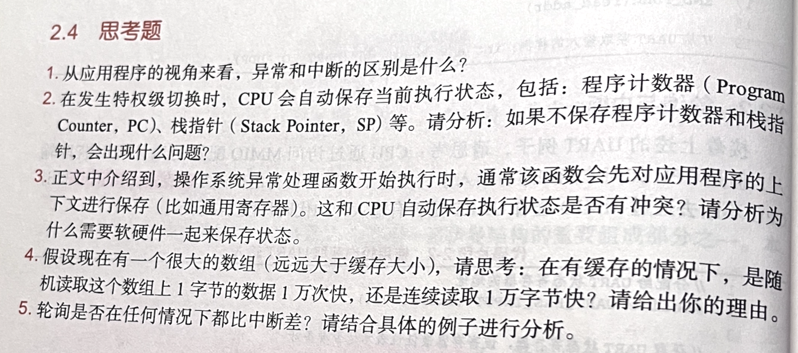


# 第3章 操作系统结构


## 操作系统的设计

为了降低操作系统设计的复杂度，需要遵循的设计原则：**策略与机制分离**。

如调度过程中：

- 策略：FCFS，RR等
- 机制：调度队列的设计、调度实体的表示、调度的中断处理等


管理复杂系统的重要方法：**M.A.L.H方法**

- 模块化 (modularity)
  - 模块的划分需要考虑高内聚和低耦合，使其具有独立性。
- 抽象 (abstraction)
  - 在模块化的基础上，将接口与内部实现分离；
  - 依从模块间的自然边界，减少模块间的交互；
    - **减少错误在模块间的传递**
    - 
  - e.g. UNIX中，只需要对独立的、连续的虚拟地址空间进行设计，应用程序无需关心物理地址的具体位置。
  - e.g. 文件系统中无需关心数据在物理介质(Flash, Disk)中的具体位置，只需要通过定义好的文件系统接口(open, read, write)操作。
    - really？
- 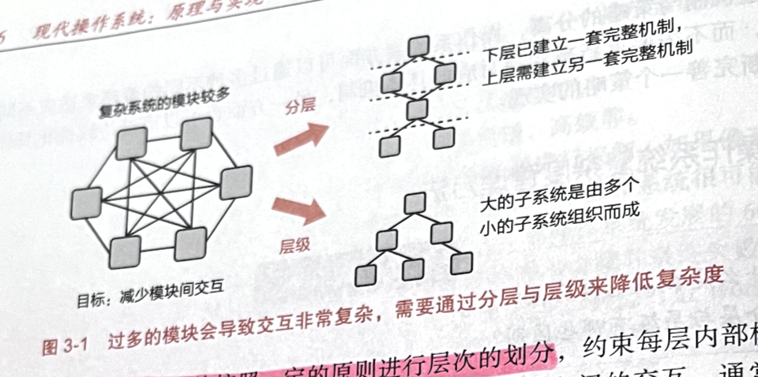
- 分层 (layering)
  - 通常的原则是：一个模块只能和同层模块以及相邻的上层或下层模块进行交互.
  - 分层也是构建复杂系统的一个重要的方式：确定层级后，我们可以先构建底层的模块，然后利用底层模块提供的功能与服务进一步构建上层的模块。
- 层级 (hierachy)
  - 首先将一些功能相近的模块组成一个具有清晰接口的自包含子系统，然后再将这些子系统递归地组成一个具有清晰接口的更大子系统。


## 操作系统内核架构

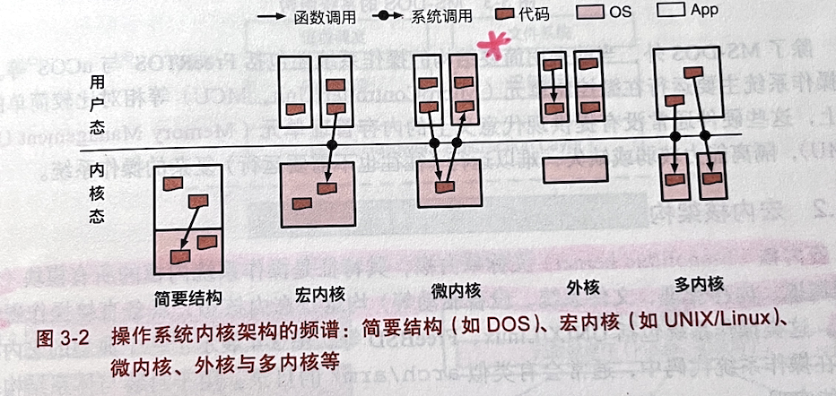


### 简要结构

简要结构，将应用程序和操作系统放在同一个地址空间，无需底层硬件提供复杂的内存管理、特权级隔离等功能。

MS-DOS(MicroSoft Disk Operating System)内部结构：

- MSDOS.Sys模块：通过命令行接口与用户交互，负责与设备驱动交互以实现对硬件设备的控制
- IO.Sys：IO子系统实现对硬件设备I/O访问的管理，以I/O请求作为抽象为MSDOS.Sys和驱动设备I/O提供服务

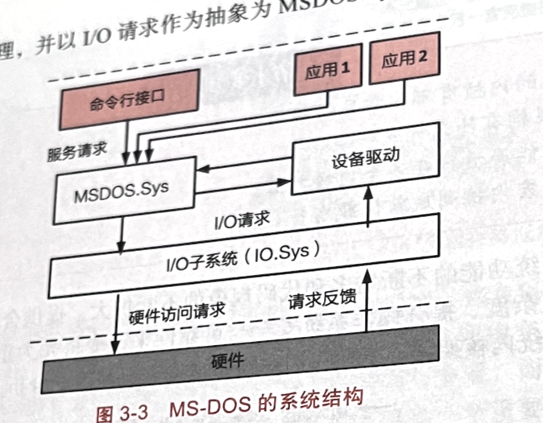


FreeRTOS和uCOS等也采用简要结构。

- 主要运行在微控制单元(MicroController Unit, MCU)等相对简单的硬件上
  - 没有提供现代意义上的内存管理单元(Memory Management Unit)
- 隔离能力较弱或缺失

### 宏内核架构

宏内核(Monolithic Kernel)又称单内核。

特征：操作系统内核的所有模块均在内核态。具备直接操作硬件的能力。

> 模块：包括进程调度、内存管理、文件系统、设备驱动等。

UNIX/Linux, FreeBSD采用宏内核架构。

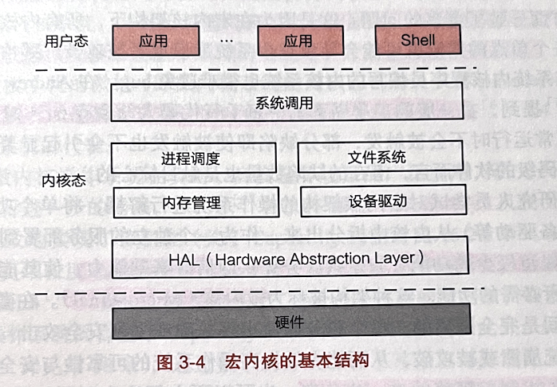

宏内核架构中的M.A.L.H:

1. 模块化
   1. UNIX/Linux, Windows内核均采用模块化
   2. 提供了可加载内核模块(Loadable Kernel Module, LKM)机制。
      1. 例如当前大部分设备驱动是以可加载模块的形式存在的，与内核其他模块解耦。
2. 抽象
   1. UNIX将文件作为一个重要的抽象,everything is a file
3. 分层
   1. 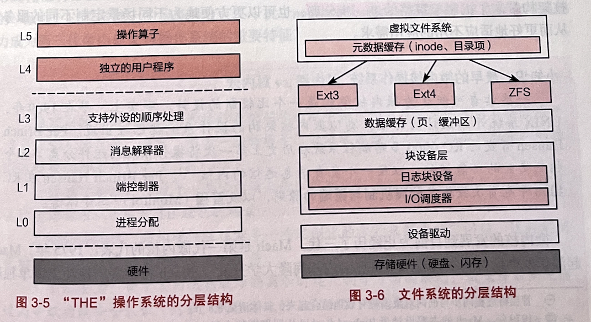
4. 层级
   1. 调度子系统中对优先级的分类
   2. 控制组(cgroup)对进程层级的分类
   3. 内存分配器对不同内存的分类

### 微内核架构

根据Andrew Tanenbaum等人的论文中提到，一般工业界系统中每千行代码大约有6～16个缺陷。

并且，宏内核架构下，所有内核模块均运行在特权空间，一个单点错误就可能导致整个系统的崩溃。

微内核架构：内核仅保留极少的功能，为这些服务提供通信等基础功能，使其能够互相协作以完成操作系统所必须的功能。

> 最早的微内核操作系统：
>
> 1969年，Per Brinch Hansen开发的RC 4000，首次提出了分离机制与策略的原则和管程这个概念。


#### 第一代微内核

> Mach是第一代微内核的代表。
>
> 缺点：
>
> Mach对进程间通信(Inter-Process Communication, IPC)的设计过于通用
>
> Mach微内核自身资源(CPU, CPU缓存等)占用过大。


#### 第二代微内核

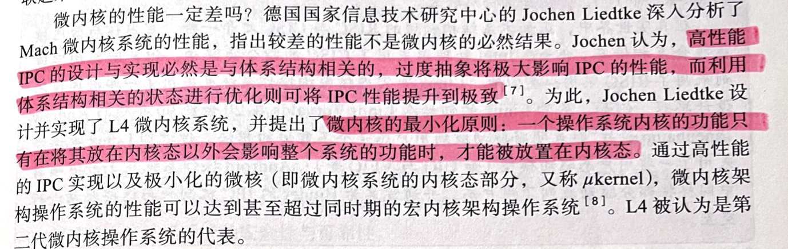

高性能的IPC实现。

​    +

极小化的微核。


#### 第三代微内核

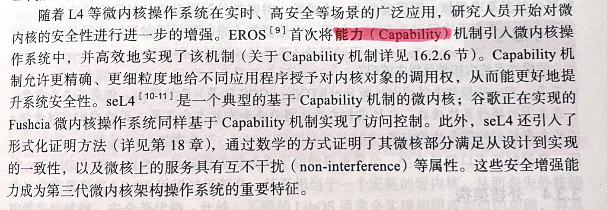


#### 微内核 vs 宏内核

- 弹性扩展能力：宏内核很难通过简单的裁剪或扩展，使其支持资源诉求从KB到TB级别的场景。
- 硬件异构性：异构硬件往往需要一些定制化的方式来解决特定问题，这种定制化对于宏内核来说很难得到长期的支持。
- 功能安全：由于宏内核在故障隔离和时延控制等方面的缺陷，截至目前尚无通过高等级功能安全认证（例如，汽车行业的 ASIL-D）的先例。
- 信息安全：宏内核架构的操作系统存在较大的信息安全隐患，如内核态驱动容易造成低质量的驱动代码入侵内核，粗粒度权限管理容易带来权限漏洞。
  - 如何入侵内核？Memory Leak？
- 确定性时延：由于宏内核架构资深隔离较为困难，且各模块耦合度高导致难以控制系統调用的时延，因此较难做到确定性时延；即便为时延做一些特定优化（例如Linux-RT补丁，时延抖动仍然较大）。
- Linux近期逐步采用了一些用户态驱动模型(UIO,VFIO等)
- Andriod在Treble项目中同样将部分驱动放入了用户态，并通过名为Binder的IPC机制来与这些驱动进行互动。

### 外核架构

操作系统内核在硬件管理方面的两个主要功能是资源抽象与多路复用 (multiplexing)

对硬件资源抽象存在的问题：

1. 过度的硬件资源抽象可能会带来较大的性能损失，违反“抽象但不隐藏能力”(abstract but don't hide power)原则
2. 操作系统所提供的硬件资源是针对所有应用的通用抽象。这些抽象对一些具体的应用(如数据库，Web服务器等)往往不是最优选择。


在许多场景，应用比操作系统更了解应该如何去抽象和使用硬件资源。应当由应用来尽可能控制对硬件资源的抽象。


**LibOS**，将对硬件的抽象封装到LibOS中(将硬件资源的抽象模块化为一系列的库，LibOS)，与应用直接链接，降低应用开发的复杂度。

操作系统内核只负责对硬件资源在多个库操作系统之间的**多路复用**的支持，并管理这些LibOS的生命周期。

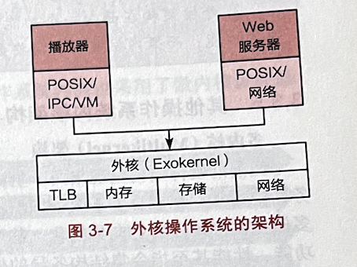

优点

> 1. 可按照应用领域的特点与需求，动态组装成最适合该应用领域的LibOS，最小化非必要的代码，从而获得更高的性能；
> 2. 处于硬件特权级的操作系统内核可以做到非常小，并且由于多个LibOS之间的强隔离性；从而可以提升整个计算机系统的安全性与可靠性。


应用

> 1. 一些功能受限、对操作系统接口要求不高但对性能和时延特别敏感的嵌入式场景。
>    1. 将数据面与控制面分离。
>    2. 数据面：（data plane）负责数据的处理与转发
>    3. 控制面：（control plane）负责设备的管理和配置
> 2. 当前云计算平台的容器（container）架构很多都采用了脱胎于外核架构的 Unikernel（本质上是一个 Libos)，通过将虚拟机监控器作为支撑 Unikernel/Libos 运行的内核，从而支持对高性能业务的独立部署。


劣势

>LibOS通常为某种应用定制，缺乏跨场景的通用性，应用生态差。
>
>- 难以用于功能要求复杂、生态和接口丰富的场景。
>- LibOS需要做得过于复杂，相当于一个完整的宏内核。
>  - 丧失了外核架构带来的性能、安全优势。
>- LibOS通常会实现相同、类似的功能
>  - 代码冗余
>  - 因此对于资源受限的场景
>    - 通常需要一些跨地址空间的代码去重
>    - 或共享机制来减少内存开销


### 外核vs微内核

硬件资源抽象

1. 外核架构中，将多个硬件资源分为一个个切片，每个切片中保护的多个硬件资源由LibOS管理，并直接服务于一个应用。
   1. 应用：指为了完成某个功能的应用集合。
2. 微内核架构中，通过让一个操作系统模块独立运行在一个地址空间，来管理一个具体的硬件资源，微操作系统中所有的应用服务。

内核管理

1. 外核架构中，运行在特权级的内核主要为LibOS提供硬件的多路复用能力，并管理LibOS
2. 微内核架构中，内核主要提供进程间通信（IPC）功能

场景

1. 外核架构在面向一个功能与生态受限的场景时可通过定制化LibOs获得非常高的性能
2. 微内核架构则需要更复杂的优化才能获得与之类似的性能。


### 多内核架构

#### 多核与众核

一般认为8个及以下处理器核为多核，多于8个处理器核称为众核。

#### Dennard缩微定律

> 随着晶体管变得越来越小，它们的功率密度保持不变，从而使功率使用与面积成比例。
>
> 此定律已终结。why？

#### MultiKernel

- 将一个众核系统看成一个由多个独立处理器核通过网络互联而成的分布式系统。

- 与传统操作系统类似，假设硬件处理器提供全局共享内存的语义。

- 不同处理核之间的交互，提供了一层基于进程间通信的抽象。

  - 避免了处理器核之间通过共享内存进行隐式的共享。
    - 避免了传统OS中，复杂的隐式共享所带来的性能可扩展性瓶颈。

- 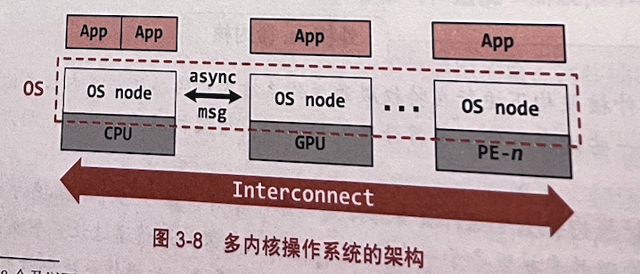

- 每个CPU核上运行一个独立的OS node

  - 节点之间的交互由OS node之间的IPC完成。
  - OS node是独立的，并且可以是不同的，很容易支持异构处理器架构。
  - 但是，不同的OS node之间存在状态冗余，对资源开销会造成一定的压力。
  - 上层应用必须使用MultiKernel提供的进程间通信接口才能交互，绝对性能方面不一定存在优势，且需要移植现有应用才能适应MultiKernel架构。
    - 是否存在平滑迁移的方法？比如接受原本的接口，直接转换为MultiKernel的接口？？

  

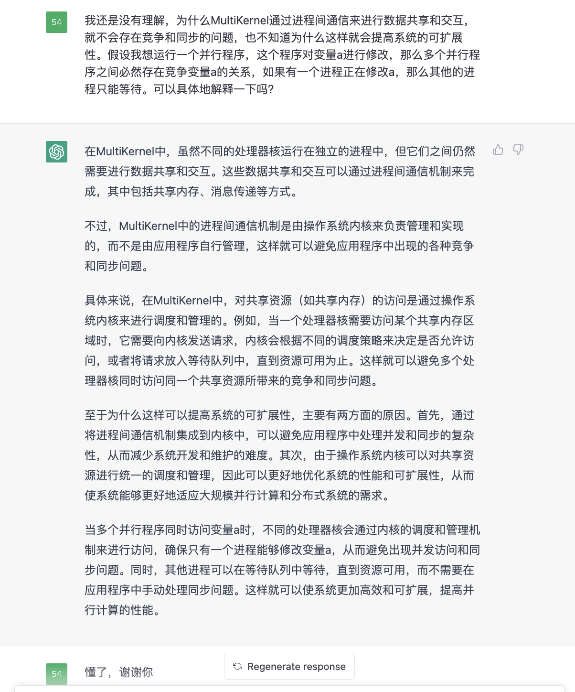

### 混合内核架构

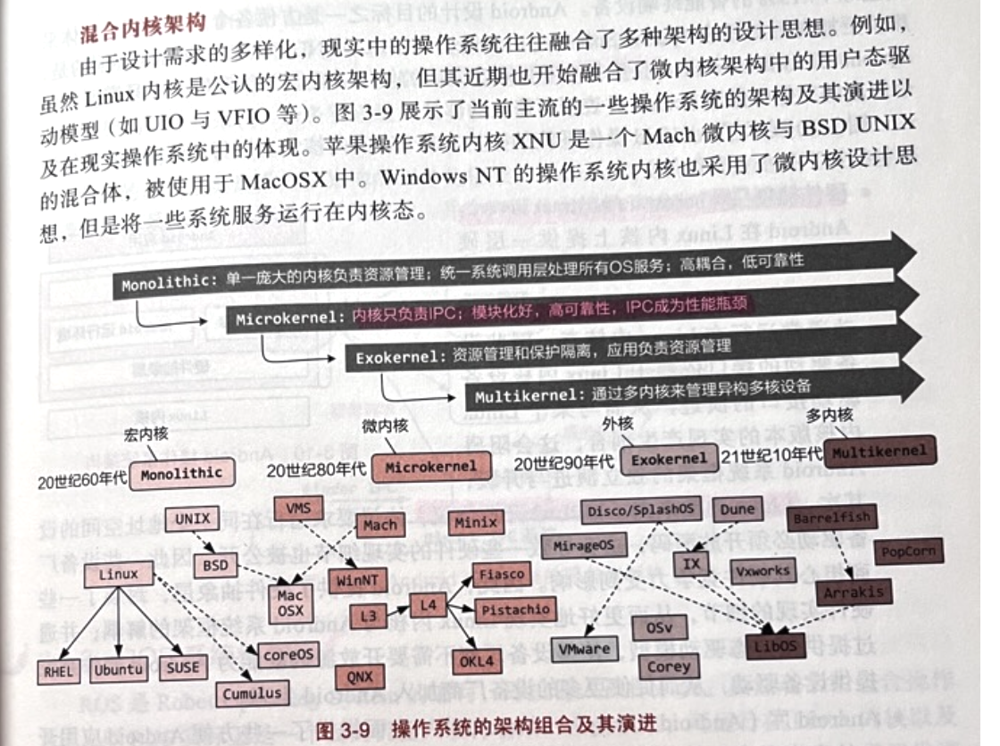


## 操作系统框架结构

### Andriod系统架构

Apache Software License，商用友好

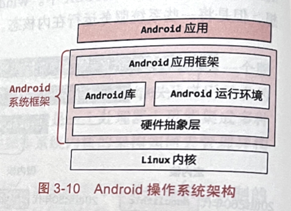

1. 硬件抽象层
   1. 在Linux内核上提供一层硬件抽象层的原因
      1. 设备驱动运行在Linux内核态，因此设备驱动接口依赖于Linux内核设备驱动接口的演进
         1. 会阻碍安卓系统的独立演进和升级
      2. Linux内核采用GPLv2开源协议，要求运行在同一地址空间的设备驱动必须开源，这会导致一些硬件的实现细节也被公开。
   2. 硬件抽象层，封装了一些硬件的细节，解耦Linux内核和Android系统
   3. 通过提供用户态驱动模型，使得设备厂商不需要开放源码就能为Andriod操作系统提供设备驱动。
2. Android运行环境
   1. andriod主要使用java进行开发，需要一个运行时环境，将应用从字节码转化为可执行代码。
   2. 早期的Android采用 Dalvik 虚拟机的形式，通过解释执行与 JIT ( Just in-Time）编译的方式运行，因而带来一些性能与功耗的损失。
   3. 5.0后引入了ART，通过Ahead-of-Time(AOT)预先编译的方式，将java代码预编译为二进制可执行代码，从而避免运行时的编译开销。
3. Android应用架构
   1. 包括服务管理、活动管理、包管理、窗口管理等。


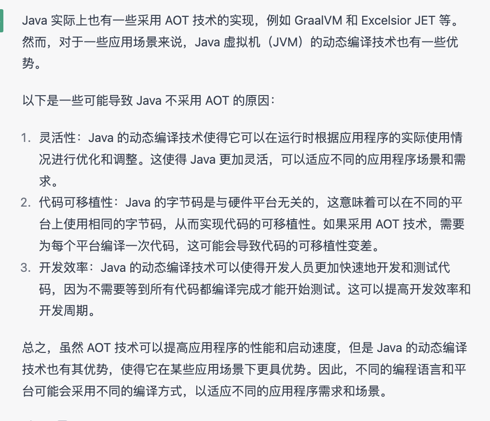


#### 服务化架构与Binder IPC

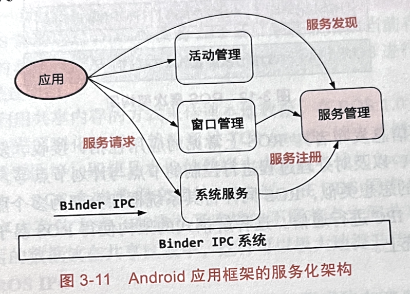


### ROS系统架构

Robot Operating System

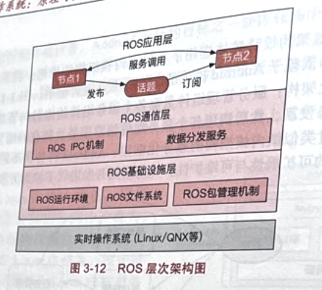


基础设施层的运行环境指Python、C++等运行环境。

ROS应用层是由一个个节点构成的计算图。

# 章节导读

### 《操作系统调试》章节导读

调试与测试是软件开发流程中极其重要的步骤，调试用于分析、定位并修 复软件实现中的错误，而测试则通常用于确定软件实现是否符合设计预期，或者评估软件实现的质量。作为计算机软件栈底层，操作系统的正确性关系到上层应用能否正常运行，同时操作系统的性能也会对应用的性能造成直接影响， 因此调试和测试在操作系统中扮演了重要的角色。在本章中，我们将简单介绍操作系统调试和测试环节中较为常用的手段和实现方法。

学完本章你应当能回答以下问题：

\- 操作系统是如何支持调试器运行的？

\- 常见的操作系统追踪机制的使用场景和实现原理是什么？

\- 如何获取并利用基于硬件的性能监控信息？

\- 对操作系统的测试可以从哪些角度进行？测试时需要遵循哪些原则？


### 《操作系统安全》章节导读

安全，是操作系统所提供的一个必不可少的功能和服务。一方面，应用程序多种多样，存在bug不可避免，操作系统需要提供权限控制与应用隔离机制，使系统的稳定性不会因为一个应用而受到影响。另一方面，万物互联使得系统面临着范围更广、威胁更大的全新安全挑战，因此操作系统同样需要提高自身的防御能力。

学完本章你应当能回答以下问题：

\- 为什么说“没有绝对的安全”？

\- 什么是访问控制？认证与授权是什么？DAC和MAC有什么区别？

\- SELinux是什么？为什么有了文件系统的权限控制机制，还需要SELinux？

\- 操作系统有哪些常见的漏洞？面临哪些常见的攻击？

\- 如果操作系统不可避免的存在漏洞，还能如何保护应用的安全？


### 《网络协议栈与系统》章节导读

多台机器间进行协同工作离不开网络通信。网络通信是现代操作系统提供的跨机器进程通信的基本方式。

本章首先以Linux内核为例，对内核协议栈的收包处理流程进行梳理，同时回顾TCP/IP网络协议栈的四层模型。数据包处理主要围绕于Linux内核协议栈的核心数据结构sk_buff，借助指针操作，内核可以实现不同层次间数据传递的“零拷贝”。

但是内核协议栈在面对高速以太网络处理时也开始显得力不从心，上下文切换、数据拷贝等因素使得内核协议栈架构变得低效。于是乎，用户态网络处理DPDK应运而生。用户态网络处理彻底绕过了操作系统内核，在高性能网络上独领风骚。

随着虚拟化网络设备的出现，库操作系统（Unikernel）引入了数据面和控制面分离的网络架构：控制面负责数据链路的搭建和数据面的管理，数据面则全权负责网络包的处理和转发，该架构能显著提高网络处理效率。

出于可靠性的考量，微内核将网卡驱动、网络协议栈置于用户态进程服务进行隔离。本章接着以ChCore微内核系统为例，介绍微内核的网络设计，以及是如何用用户态缓冲、共享内存等机制来避免大网络包数据传输导致的性能开销的。

对于新兴的网络技术，如RDMA和SmartNIC，建议读者阅读本课程的配套书籍进行学习。

学完本章，你应当能回答以下问题：

\- 在Linux上，一个网络包是如何从网卡一步步传送给用户程序的？

\- DPDK是如何提升网络包处理性能的？

\- 作为微内核的ChCore是如何进行网络设计的？

\- 宏内核、微内核、库操作系统之间的网络架构有何区别，各有什么优势？

### 《系统虚拟化》章节导读

基础设施即服务是一种重要的云计算模式，大大提高了物理服务器的资源利用率，同时降低云租户使用服务器资源的成本。系统虚拟化技术是支撑云计算模式的核心底层技术。该技术能在一台物理机器上创建多个虚拟机。从应用程序的角度来看，虚拟机和真实的物理主机几乎没有区别，制造独占使用一台服务器的假象。本章将从软件和硬件两个角度深入介绍CPU虚拟化、内存虚拟化、I/O虚拟化的技术细节。同时，本章还会介绍容器技术这种当下十分流行的轻量级虚拟化技术，以Linux中的命名空间和控制组技术为例，对两个核心问题——资源视图隔离和性能隔离进行讨论。

学完本章你应当能回答以下问题：

\- 什么是系统虚拟化？

\- CPU虚拟化、内存虚拟化、I/O虚拟化的实现细节是什么？

\- 硬件虚拟化技术和软件虚拟化技术的相同与不同之处？它们分别适用于什么场景？

\- 什么是容器技术？容器技术与轻量级虚拟化的关系是什么？

\- 资源视图隔离和性能隔离的目标分别是什么？


### 《设备管理》章节导读

操作系统的重要任务之一是对底层的硬件设备进行管理，并为上层应用提供相应的抽象，方便应用程序与硬件设备进行交互。为了和设备进行对话，操作系统需要安装相应的驱动程序，以此控制设备并监视设备的运行状况。

设备不仅能响应操作系统的I/O请求，还能通过“中断”主动通知操作系统任务的执行情况。中断处理是操作系统设备管理过程中非常重要的环节，本章以Linux内核的上下半部机制来展示现代操作系统是如何响应和处理中断的。

随着计算机的演化和发展，设备种类不断增加，同类型设备自身也在不断迭代更新，如何为操作系统的驱动开发人员提供便利的抽象，简化设备驱动程序的开发，也成为操作系统设备管理的重要议题。我们将以宏内核Linux与微内核Zircon为例，分别介绍其设备抽象与驱动模型。

由于驱动自身的复杂性，将驱动程序从内核态中分离出去有利于提高操作系统的可靠性，本章的最后分别介绍了微内核Zircon驱动模型与Linux的用户态驱动框架。

学完本章，你应当能回答以下问题：

\- 操作系统是如何识别计算机设备的？

\- 计算机设备与操作系统有哪些通信机制？

\- 操作系统是如何管理设备中断的？

\- 现代操作系统的设备抽象和驱动模型是如何设计的？

\- 现代操作系统是如何支持用户态驱动程序的？


### 《文件系统与存储》章节导读

存储是现代操作系统最重要的功能之一。随着大数据时代的到来，数据规模呈现爆炸式增长。无论是日常生活中我们使用到的图片、音乐、文档、视频、电子邮件，还是隐藏在大数据之下的账户信息、预测模型，均需要通过现代操作系统保存在存储设备中。另一方面，存储设备也在不断发展，以适应日益增长的数据需求。如机械硬盘的容量从GB级别提升到TB级别，高性能固态硬盘逐渐成为了“标配”，非易失性内存等新型存储设备逐步开始使用。

文件系统是现代操作系统中提供存储功能、管理存储资源的重要模块。对上层用户和应用程序来说， 文件系统提供文件抽象并实现文件访问所需要的接口。 对下层存储设备来说， 文件系统以特定格式在存储设备上维护着每个文件的数据和元数据。在本章中，我们将从一个基于 inode 的文件系统出发， 介绍文件系统中常见的概念和设计方法；然后以 Linux 中的虚拟文件系统为例，介绍操作系统是如何对多个不同文件系统进行管理，并对应用程序提供文件功能。

经过本章的学习，你将能够回答以下这些问题：

\- 什么是硬盘格式化？为什么格式化后硬盘的空间减少了？

\- 一个简单的文件系统如何保存常规文件、目录文件和其他类型的文件？

\- 多个文件系统是如何在同一个操作系统中共同工作的？

\- 用户态文件系统有哪些优点？如何在宏内核中提供用户态文件系统机制？


### 《同步原语》章节导读

在操作系统中，不同核心上的多个线程可能会协作完成同一个任务，导致对共享数据的竞争。为了辅助多个线程之间进行同步，保证程序的正确性，操作系统提供了一系列同步原语供应用使用。

在本章中，我们介绍了用于保证互斥访问的互斥锁；用于管理多个资源的信号量；用于控制读写的读写锁以及更加高效的RCU。除此之外，我们还讨论了由于同步原语带来的种种新的问题：包括由于循环等待造成的死锁；由于相互退让导致的活锁；以及由于调度器导致的优先级反转。

学完本章你应当能回答以下问题：

\- 同步原语和操作系统有何种关系？哪些同步原语必须由操作系统支持才能实现？

\- 本章介绍的各种同步原语区别在哪？分别适合应用在哪些场景？

\- 如何解决死锁、活锁与优先级反转问题？


### 《进程间通信》章节导读

使用多进程协作来实现应用和系统是一种被广泛使用的开发方法。多进程协作主要有以下优势：首先，将功能模块化，避免重复造轮子。相同的功能可以由单一进程实现，并且通过协助的方式为其他进程服务。其次，增强模块间的隔离，提供更强的安全保障。最后，提高应用的容错能力。

进程间通信（Inter-Process Communication，IPC）是多进程协作的基础。 本章将首先介绍进程间通信的基础概念和特性；随后，将围绕宏内核和微内核这两类场景，介绍经典的通信设计；最后还将讨论一些具体的案例中的通信设计。

学完本章你应当能回答以下问题：

\- 进程间通信有哪些设计选择?

\- 进程间通信过程中，数据和控制流分别是怎么传输和转移的? 

\- 进程间通信的连接是怎么建立的?

\- 宏内核下有哪些常见的进程间通信机制？

\- 微内核系统有哪些针对于数据传输和控制流转移的优化？


### 《操作系统调度》章节导读

现代操作系统通过调度协调多个程序的执行，调度可以决定程序的线程应该运行在哪个CPU核心上、运行多久等。由于多种工作场景的需求不同，评判调度的指标也多种多样，其中某些调度指标是相互冲突的。为了满足特定场景的需求，调度策略需要在调度指标中进行取舍，这也增加了设计实现操作系统调度的难度。伴随着计算机的发展，调度一直是操作系统研究的重要一环。在本章中，我们将深入了解操作系统中的调度策略与机制。

学完本章你应当能回答以下问题：

\- 为什么需要操作系统调度？其目的与挑战分别是什么？

\- 不同调度策略的优缺点应该如何分析？

\- 针对不同的场景和指标，应该选择何种调度策略？


### 《进程与线程》章节导读

现代操作系统需要运行各种各样的程序。为了管理这些程序的运行，操作系统提出了进程的抽象，每个进程对应一个运行中的程序。在进程的基础之上，操作系统通过一种称为上下文切换的机制制造了“很多程序同时运行”的假象，有效地实现了计算机中CPU和内存资源的共享。进程是操作系统中最重要的概念之一。

随着计算机的发展，应用类型更加多样化，进程已经满足不了它们的需要。因此，操作系统又提出了更加轻量级的抽象——线程。在现代操作系统（如Linux）中，进程和线程相互配合，协助操作系统管理运行中的程序。在本章中，我们就将深入了解这两种抽象。

学完本章你应当能回答以下问题：

\- 进程和线程有哪些相同和不同的地方？它们各自适合哪些场景？

\- 进程和线程之间的内在联系是什么？

\- 上下文切换是如何实现多个进程/线程CPU资源共享的？

\- 还有比线程更加轻量级的运行单元吗？


### 《内存管理》章节导读

操作系统究竟是如何让不同的应用程序能够既高效又安全地共同使用物 理内存资源的？现代操作系统一个普遍做法是在应用程序与物理内存之间加入一个新的抽象：虚拟内存（Virtual Memory）。应用程序是面向虚拟内存而不再是物理内存编写的；应用程序运行时只能使用虚拟地址，CPU 负责将虚拟地址翻译成物理地址，操作系统负责设置虚拟地址与物理地址之间的映射。操作系统仅将应用程序实际使用的虚拟地址映射到物理地址，从而提高内存资源的利用率；每个应用程序只能看到自己的虚拟地址空间，从而保证不同应用程序内存之间的隔离；每个应用程序的虚拟地址空间是统一的、连续的，从而降低了编程的复杂性。在提供虚拟内存抽象的同时，操作系统仍然需要把真实的物理内存分配给每个应用程序。在分配物理内存的时候，操作系统一方面需要保证物理内存的利用率，另一方面要保证分配物理内存的速度。为此，现代操作系统通常会使用不止一种物理内存分配器进行物理内存资源的分配。在本章中，我们将首先介绍虚拟内存的抽象与实现，然后介绍操作系统对虚拟内存和物理内存的管理方法。

学完本章你应当能回答以下问题：

\- 什么是页表，为什么需要多级页表？

\- 为什么需要 TLB 以及 TLB 的工作原理？

\- 什么是换页/缺页，以及为什么需要它们？

\- 操作系统可以如何分配物理内存？


### 《操作系统结构》章节导读

现代操作系统的结构已经十分复杂，而且还在变得更加复杂。对于这样的复杂系统而言，合理的架构与设计是不可或缺的。通常，操作系统的设计需要在用户目标（如方便使用、容易学习、流畅等）和系统目标（如易维护、不易出错、灵活等）之间进行权衡，如果过分追求某一方面，就有可能导致设计结构不合理并最终失败，而这样的例子在操作系统发展的60多年历史中并不罕见。本章将主要围绕操作系统的设计方法和典型的操作系统结构展开介绍，帮助你理解现代操作系统中的一些基础设计方法与架构。

学完本章你应当能回答以下问题：

\- 什么是机制和策略？两者有什么区别和联系？

\- 操作系统的内核有哪些常见的架构？

\- 不同操作系统架构之间有什么差别？都有什么优缺点？


### 《硬件基础》章节导读

操作系统的主要职责是对下管理硬件、对上对应用提供服务。虽然硬件平台有许许多多，但是操作系统的设计都遵循着一些基本的原则和方法。我们需要了解一下操作系统如何管理硬件，比如：操作系统如何与硬件进行交互？操作系统需要知道硬件实现的完整细节吗？操作系统是如何在不同硬件的具体平台上兼容的？这一系列问题，都和我们本章所学习的硬件结构息息相关。在本章中，我们将以AArch64体系结构为例，从操作系统的视角来理解硬件，包括CPU给操作系统提供的接口、操作系统与CPU交互的方式、CPU访问内存的方式等等。

学完本章你应当能回答以下问题：

\- ARM处理器的特点是什么？ARM、AArch64、RISC等相关术语是什么意思？

\- CPU给操作系统提供的抽象（如状态和指令）有哪些？

\- 操作系统与CPU等硬件的交互方法有哪些？它们又是怎么通过软硬件协同的方法进行处理的？

\- CPU是如何访问内存的？CPU缓存在这个环节中起到了什么作用？

### 《操作系统介绍》章节导读

欢迎来到操作系统课程！在这门课程中，我们将从现代操作系统入手，深入介绍操作系统的设计原理、组成部分以及发展趋势。我们还准备了一个教学用操作系统——ChCore，同学们可以在自己动手的过程中对操作系统中的各种概念有更加深刻的理解。相信在学完本章后，同学们会喜欢上操作系统这一复杂又美丽的“智慧结晶”！

本章是课程的第一章，将主要介绍操作系统的基本概念。学完本章你应当能回答以下问题：

\- 什么是操作系统？

\- 如果我不是操作系统开发人员，我还需要学习操作系统吗？

\- ChCore作为教学操作系统，有哪些有趣的特点？我能从中学到什么？


## 课程主页

https://ipads.se.sjtu.edu.cn/mospi/

