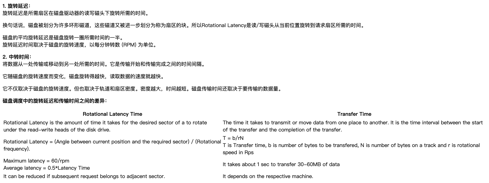

高级数据库系统课程笔记
教学内容与CMU15-445基本相似。

<!--more-->
# 磁盘

## 磁盘结构
os与磁盘之间交流的最小单位是磁盘块。磁盘块是一个虚拟概念，对软件(os)有意义。操作系统决定块大小的配置。块大小 = 扇区大小<<n。

- 操作系统与内存通信的最小单位：页。
- 操作系统与硬盘通信的最小单位：块。

**扇区**将磁道划分为若干个弧段。扇区是磁盘的最小组成单位。扇区通常是512字节，也有4096字节的。

## 时间的计算
随机读取磁盘块的平均延迟：
- **读取时间 = 寻道时间 + 旋转延迟时间 + 传输时间**

### 寻道时间
最小寻道时间指磁头寻道到**相邻磁道**的时间

### 旋转延迟时间
从磁盘寻道结束开始，直到**磁头旋转到I/O请求所请求的起始数据块位置**止，这之间的时间间隔称为旋转延迟。

- **旋转延迟时间 = 1/(2\*磁盘转速)** 
- 磁盘转速：单位RPM, r/min

### 传输时间
- **传输时间 = 读写字节数/(磁盘转速 \* 磁道字节数)**

### 旋转延迟与中转时间的区别

<!-- # 索引 -->